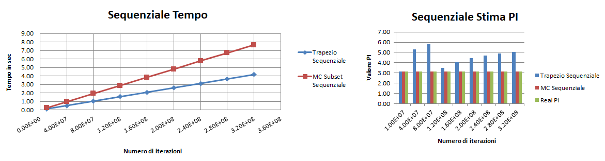

# Finding PI using MPI

Implementazione e confronto di soluzioni algoritmiche dell'approssimazione del calcolo di **PI** (regola del trepazio e metodo di Monte Carlo) mediante **MPI** utilizzando comunicazioni **Point-to-point** su istanze di tipo **M4.XLarge** di AWS;

### Programmazione Concorrente, Parallela e su Cloud
### Università degli Studi di Salerno
#### *Anno Accademico 2017/2018*

**Professore:** _Vittorio Scarano_
**Dottore:** _Carmine Spagnuolo_
**Studente:** _Egidio Giacoia_

--------------------------------------------------------------------------------------------------------

## Problem Statement - Regola del Trapezio

Data la funzione f(x)=4/(1+x^2), è possibile stimare il valore di **PI** calcolando l'integrale definito di f(x) da 0 a 1.

### Soluzione MPI - Trapezio (File: Trapezoidal_Rule_MPI.c)

La soluzione proposta è quella di partizionare il dominio del problema, cioè il **numero di iterazioni**, tra i processori a disposizione in maniera da distribuire equamente il carico di lavoro.
Ai fini della soluzione tutti i processori, sia *MASTER* che *SLAVES*, sono impiegati nella computazione.
 
- Si calcola il numero di iterazioni da eseguire ```quotient``` per ciascun processore; 
- Se abbiamo iterazioni rimanenti ```rem ```  queste vengono distribuite dando +1 iterazione in più ai primi reminder processori;

```c
quotient = (int) niter / num_proc;
rem = (int) niter % num_proc;
sub_iter = my_rank < rem ? quotient+1 : quotient;
```

In definitiva la variabile ```sub_iter``` contiene il numero di iterazioni che deve eseguire il processore corrente.

Ciascun processore inoltre dovrà inziare la computazione da un determinato valore che viene incrementato ad ogni ietrazione, in quanto i valori parziali utilizzati dalla regola del trapezio dipendono da esso.
Tale informazione è memorizzata nella variabile ```sub_start```.
```c
if(rem == 0) sub_start = my_rank*quotient;
else sub_start = my_rank*quotient+my_rank-(my_rank>rem);
```c
A questo punto ogni processore calcola il proprio valore locale in base al range definito precedentemente, chiamando la funzione ```trapezoidal_rule(int,int)```, passandole l'inizio dell'iterazione ```sub_start``` e quando arrestarsi ```sub_start+sub_iter``` .  
```c
double trapezoidal_rule(int start,int finish){
	int i;
	double result = 0.0, x2 = 0.0;
	for(i=start; i< finish; i++){
		x2 = d2 * i * i;
		result += 1.0 / (1.0 + x2);
	}
	return result;
}
 . . .
 
local_result = trapezoidal_rule(sub_start,sub_start+sub_iter);  	/* current process calculate is local_result */	
```
Una volta calcolato il valore locale ```local_result``` ogni processore *SLAVE* lo invia al processore *MASTER* tramite l'invocazione della funzione ```MPI_Send(...)```
```c
	/* Current process send is local_result to Master process (rank = 0) */
	if(my_rank != 0) MPI_Send(&local_result,1,MPI_DOUBLE,0,0,MPI_COMM_WORLD);
```
Il processore *MASTER* riceve iterativamente i valori inviati dai processori *SLAVES* tramite la funzione ```MPI_Recv(...)``` e li somma insieme al valore locale propriamente calcolato, ottenendo un valore globale ```result```e calcola l'approssimazione finale di ```pi``` .
```c
	else{ // Master process
		result = local_result;
			/* Get back the local_result from the others */
        	for (rank=1;rank<num_proc;++rank){
             		MPI_Recv(&local_result,1,MPI_DOUBLE,MPI_ANY_SOURCE,0,MPI_COMM_WORLD, &status);
             		result += local_result;
        	}
			/* Calculation of the approximation of PI */
        	pi = 4 * d * result;
```

## Problem Statement - Metodo di Monte Carlo

Dato un cerchio di raggio 1, esso può essere inscritto in un quadrato di raggio 2. Focalizzandosi sul primo quadrante, l'area del quadrato è 1 e l'area dell'area cerchio è invece pi/4. 
Se generiamo N numeri random all'interno del quadrato il numero di punti che cadono nel cerchio M diviso il numero totale di numeri generati N dovrà approssimare appunto l'area del cerchio e quindi p/4.
In sostanza otterremo pi = 4 * M / N.

### Soluzione - Monte Carlo Subset (File: Monte_Carlo_Subset_MPI.c)

Questa soluzione è del tutto analoga a quella mostrata nella regola del trapezio.

Si partiziona il **numero di iterazioni** tra i processori a disposizione in maniera da distribuire equamente il carico di lavoro.
Ai fini della soluzione tutti i processori, sia *MASTER* che *SLAVES*, vengono impiegati nella computazione.
 
- Si calcola il numero di iterazioni da eseguire ```quotient``` per ciascun processore; 
- Se abbiamo iterazioni rimanenti ```rem ```  queste vengono distribuite dando +1 iterazione in più ai primi reminder processori;

In definitiva la variabile ```sub_iter``` contiene il numero di iterazioni che deve eseguire il processore corrente.
```c
quotient = (int) niter / num_proc;
rem = (int) niter % num_proc;
sub_iter = my_rank < rem ? quotient+1 : quotient;
```
Con questa suddivisione ciascun processore effettua un certo un numero di sotto-iterazioni andando a "misurare" i punti scelti in maniera pseudocasuale che ricadono nell'area del cerchio nel 1° quadrante.
Questa informazione è memorizzata nella variabile ```local_count```. 
```c
	/*  measurement of the number of pseudorandom points that fall within the circle area*/
	for(i=0; i<sub_iter; i++){
		x = (double) rand() / RAND_MAX;
		y = (double) rand() / RAND_MAX;	
		z = x*x + y*y;
		if(z<=1) local_count++;	
	}
```
Successivamente tutti i processori *SLAVE* inviano il numero di punti trovati ```local_count``` al processore *MASTER* utilizzando la funzione ```MPI_Send(...)```.
A questi punto il processore *MASTER* riceve iterativamente i valori inviati dai processori *SLAVES* tramite la funzione ```MPI_Recv(...)``` e li somma insieme al valore locale propriamente calcolato 
nella variabile ```count```. Infine procede a determinare il valore approssimato di **PI**: ```pi = (double) count / niter * 4;```
```c
	/* Current process send is count to Master process (rank = 0) */
	if(my_rank != 0) MPI_Send(&local_count,1,MPI_INT,0,0,MPI_COMM_WORLD); 
	else{ // Master process
		count = local_count;

		/* Get back the local_count from the others */
        	for (rank=1;rank<num_proc;++rank){
             		MPI_Recv(&local_count,1,MPI_INT,MPI_ANY_SOURCE,0,MPI_COMM_WORLD, &status);
             		count += local_count;
        	}
		/* Calculation of the approximation of PI */
		pi = (double) count / niter * 4;
	}
```

### Soluzione Alternativa - Monte Carlo Repetition (File: Monte_Carlo_Repetition_MPI.c)

Questa soluzione, invece, non viene diviso in alcun modo il dominio del problema: 
- ogni processore agisce in maniera indipendente eseguendo il numero di iterazioni assegnate in input e "misura" i punti pseudocasuali che ricadono nell'area del cerchio nel 1° quadrante. 

Successivamente tutti i processori *SLAVE* inviano il numero di punti calcolati al processore *MASTER* che procede a determinare il valore approssimato di **PI**, considerando che il numero di **iterazioni totali** è: ```niter * num_proc```.

```c
pi = (double) count / (niter *num_proc) * 4;
```

### Confronto MC Subset e MC Repetition

Non vi è alcuna differenza sostanziale in quanto **Monte Carlo Repeat** è una *generalizzazione* di **Monte Carlo Subset**. 

Per comprendere:

---|**MC Subset**|---|<=>|---|**MC Repetition**|---
:-----:|:-----:|:-----:|:-----:|:-----:|:-----:|:-----:
**# Proc**|**# Iter Input**|**# Iter Totali**|<=>|**# Proc**|**# Iter Input**|**# Iter Totali**
32|3.2E8|3.2E8|<=>|32|1E7|32*1E7 = 3.2E8
8|8E7|8E7|<=>|8|1E7|8*1E7 = 8E7
1|1E7|1E7|<=>|1|1E7|1*1E7 = 1E7

**IMPORTANTE**: Nei test vengono presi in considerazione soltanto gli algoritmi di **Monte Carlo Subset** (1° soluzione) e del **Trapezio** in quanto lavorano sullo **stesso numero di iterazioni** e, dunque, possono essere confrontati in maniera semplice e diretta.

## Progetto: compliazione & esecuzione

Il progetto contiene i seguenti file:
- **Trapezoidal_Rule_Sequential.c" -- File sorgente sequenziale della regola del trapezio
- **Trapezoidal_Rule_MPI.c" -- File sorgente parallelo della regola del trapezio
- **Monte_Carlo_Sequential.c" -- File sorgente sequenziale del metodo di Monte Carlo
- **Monte_Carlo_Subset_MPI.c" -- File sorgente parallelo del metodo di Monte Carlo (1° Soluzione)
- **Monte_Carlo_Repetition_MPI.c"-- File sorgente parallelo del metodo di Monte Carlo (Soluzione Alternativa - **NO TEST**)
- **Makefile** -- File per la compilazione automatica dei sorgenti

Per compilare i sorgenti eseguire i seguenti comandi:

```
make clean
make 
``` 

Il risultato della compilazione saranno i seguenti eseguibili:

- **Trapezio** -- Programma parallelo della regola del trapezio
- **MC_Subset** -- Programma parallelo del metodo di Monte Carlo (1° Soluzione)
- **MC_Repetition** -- Programma parallelo del metodo di Monte Carlo (Soluzione Alternativa - **NO TEST**)

Per eseguire la versione *parallela* in locale dare il seguente comando:

```
bash
mpirun -np <NUM_PROC> -host localhost <NOME_PROGRAMMA> <NUM_ITER [optional]>
```

- *NUM_PROC* rappresenta il numero di processi MPI da lanciare
- *NOME_PROGRAMMA* è uno dei file eseguibili presentati precedentemnte;
- *NUM_ITER* rappresenta il numero di iterazioni da eseguire (opzionale con **Trapezio** [default: 1E7]);

Potrebbe essere necessario specificare il numero di slots per l'host, per cui creare un file nel modo seguente e modificare l'opzione -host con --hostfile <NOME_FILE>:
```
localhost slots=32
```

In alternativa al comando ```make```, i singoli sorgenti possono essere compilati eseguendo il comando ```mpicc```
In quest'ultimo caso per il file **Trapezoidal_Rule_MPI.c** è neccessario utilizzare l'opzione ```-lm```per includere la libreria ```math.h``` .

## Esecuzione del Benchmark

Il segeuente benchmark è stato eseguito su un cluster di istanze fornite da *Amazon Web Service*, eseguendo test di **Strong scaling ** e **Weak scaling**. 

Nel dettaglio:
- cluster di **8** istanze di tipo **M4.xlarge** (StarCluster AMI ami-52a0c53b Linux Ubuntu):
 - **4** core per istanza;
 - **1** istanza **MASTER**, **7** istanze **SLAVE**

Ciascun test è stato ripetuto 10 volte ed il tempo mostrato nei grafici seguenti è dato da una media tra tutti i valori ottenuti.

**IMPORTANTE**: Nei test vengono presi in considerazione soltanto gli algoritmi di **Monte Carlo Subset** (1° soluzione) e del **Trapezio** in quanto lavorano sullo **stesso numero di iterazioni** e, dunque, possono essere confrontati in maniera semplice e diretta.

### Sequenziale

Sono stati messi a confronto i vari tempi di esecuzione e la stima del valore di **PI** calcolato degli algoritmi sequenziali al crescere del numero di iterazioni (da **1E7** fino a **3.2E8**).



Dai grafici si evince che:
- **Trapezio**: risulata essere più veloce ma al crescere del numero di iterazioni perde molta precisione nello stimare PI;
- **Monte Carlo**: riesce a mantenere una stima costante con l'aumentare del numero di iterazioni ma alti tempi di esecuzione;

### Strong Scaling

Il test di **strong scaling** è stato effettuato:
- **fissando** la dimensione del problema, ovvero il numero di **iterazioni**  ad **1E7**;
- **incrementato** progressivamente il numero delle istanze, cioè il numero di **processori**.

**# istanze**|**# processori**|**Trapezio Tempo(s)**|**MC Subset Tempo(s)**
:-----:|:-----:|:-----:|:-----:
1|4|0.0338358|0.1017294
2|8|0.0208942|0.0538732
3|12|0.015946|0.0366214
4|16|0.014446|0.0292506
5|20|0.0150694|0.0263484
6|24|0.012196|0.0211484
7|28|0.011034|0.019119
8|32|0.0100318|0.0192746


Come si può vedere dai grafici il tempo di esecuzione per entrambi gli algoritmi diminuisce gradualemente con il crescere del numero di processori inizialmente, per poi quasi stabilizzarsi.

### Weak Scaling

Il test di **weak scaling** è stato effettuato: 
- mantenendo **costante** il **carico** per ogni processore, cioè **1E7 * processore utilizzati**;
- **aumentando** contemporaneamente sia la **taglia** del problema (da **1E7** fino a **3.2E8**) che il numero delle istanze (cioè il numero di **processori**).

**# istanze**|**# processori**|**# iterazioni**|**Trapezio Tempo(s)**|**MC Subset Tempo(s)**
:-----:|:-----:|:-----:|:-----:|:-----:
1|1|1.0E+07|0.130539|0.243467
1|4|4.0E+07|0.1350294|0.406079
2|8|8.0E+07|0.1378312|0.4070282
3|12|1.2E+08|0.1431404|0.4113668
4|16|1.6E+08|0.140225|0.4098818
5|20|2.0E+08|0.1456554|0.410277
6|24|2.4E+08|0.1422816|0.4203254
7|28|2.8E+08|0.1444308|0.4194002
8|32|3.2E+08|0.1448546|0.4123592


Dai grafici:
- **Trapezio**: il tempo cresce con l'aumentare della taglia del problema e del numero di processori, anche se oscilla quando si utilizzano dai 12 a 24 processori;
- **Monte Carlo**: il tempo di esecuzione rimane quasi costante all'aumentare della taglia del problema e del numero di processori.

### Confronto
Vengono ora messi a confronto i due algortmi, riportando in un unico grafico i test effettuati: 

**# istanze**|**# processori**|**Trapezio Tempo(s)**|**Trapezio Stima PI**|**MC Subset Tempo(s)**|**MC Subset Stima PI**
:-----:|:-----:|:-----:|:-----:|:-----:|:-----:
1|4|0.0338358|0.0000000999999901|0.1017294|0.0013334535897900
2|8|0.0208942|0.0000001000000101|0.0538732|0.0020086535897899
3|12|0.015946|0.0000003047925099|0.0366214|0.0008310535898000
4|16|0.014446|0.0000000999999701|0.0292506|0.0016886535897900
5|20|0.0150694|0.0000000999999998|0.0263484|0.0015926535897899
6|24|0.012196|0.0000000903703201|0.0211484|0.0003030535897999
7|28|0.011034|0.0000000779352201|0.019119|0.0016070535897899
8|32|0.0100318|0.0000000999999901|0.0192746|0.0010742535897999


**# processori**|**# iterazioni**|**Trapezio Tempo(s)**|**Trapezio Stima PI**|**MC Subset Tempo(s)**|**MC Subset Stima PI**
:-----:|:-----:|:-----:|:-----:|:-----:|:-----:
1|1.0E+07|0.130539|3.1415927535899800|0.243467|3.1412876000000000
4|4.0E+07|0.1350294|5.3032708429068400|0.406079|3.1412876000000000
8|8.0E+07|0.1378312|5.7857655259151900|0.4070282|3.1412876000000000
12|1.2E+08|0.1431404|3.5042322141969500|0.4113668|3.1412876000000000
16|1.6E+08|0.140225|4.0487880601885300|0.4098818|3.1412876000000000
20|2.0E+08|0.1456554|4.4285948871779000|0.410277|3.1412876000000000
24|2.4E+08|0.1422816|4.7040208454235500|0.4203254|3.1412876000000000
28|2.8E+08|0.1444308|4.9110895632355800|0.4194002|3.1412876000000000
32|3.2E+08|0.1448546|5.0716458519016800|0.4123592|3.1412876000000000


Osservazioni generali degli algoritmi:
- **Monte Carlo**: 
E' un algoritmo randomico, per cui incrementando il numero di iterazioni si generano più punti pseudocasuali, sperando di ottenere una stima precisa del valore di **PI**.
Tuttavia aumentando, di molto, il numero di iterazioni non si è in grado di ottenere una risposta più precisa a causa della rappresentazione in memoria della precisione dei numeri, degli errori di arrotondamento e del fatto che usiamo un generatore di numeri pseudocasuali invece di numeri del tutto casuali.
Nell'implementazione **Subset** si utilizza lo stesso seme fissato ```srand(SEED)``` per la generazione dei numeri pseudocasuali per ogni processore, rendendo la sequenza dei punti pseudocasuali identica e il numero di punti ammissibili si diminuisce in proporzione al numero di processori utilizzati (tenendo fissato il numero di iterazioni), causando una stima di **PI** poco precisa;
Per rendere la situazione più pseudocasule e diversificata per ogni processore si potrebbe fare come di seguito:
```
srand(time(NULL) + my_rank);
```

- **Trapezio**:
E' un metodo molto veloce ma è strutturato ad hoc per funzionare con un numero di iterazioni pari a **1E7** ed aumentando le iterazioni si perde precisione nel calcolare la stima del valore di **PI**.

Osservazioni dei test effettuati:
- **Iterazioni fissate (1E7) - Processori crescenti**: 
l'algoritmo del **Trapezio** riesce ad essere **più veloce** e mantiene un'**ottima precisione** nello stimare il valore di **PI** a differenza dell'algoritmo di **Monte Carlo Subset** (più **lento** e **poco preciso**).
- **Iterazioni crescenti (1E7 * # proc) - Processori crescenti**:  
l'algoritmo del **Trapezio** risulta essere **più veloce** di molto dell'algoritmo di **Monte Carlo Subset**, 
ma i valori di **PI** si **discostano di tanto** dal valore **reale** di **PI**; invece nell'algortimo di **Monte Carlo Subset** il valore di **PI** rimane **costante** nella stima ma **alti tempi** di esecuzione.

#### Collective vs Point-to-Point:
- Utilizzando comunicazione **Collective** la sistuazione non varia in entrambi gli algoritmi:
 - i processori comunicano tra loro poche volte (1 ```MPI_Send(...)``` e 1 ```MPI_Recv(...)```); 
 - il partizionamento del dominio del problema avviene senza il bisogno di un processore MASTER che suddivide e comunica ai vari processori SLAVE i domini in cui operare, per cui non c'è alcun bisogno
 di utilizzare ```MPI_Scatter(...)```
 - nella fase di raccolta dei risultati locali il MASTER potrebbe utilizzare ```MPI_Reduce(...)``` ma ai fini delle prestazioni il risulato non cambia.
 
#### Speedup

Il grafico seguente mostra lo **speedup** di entrambi gli algoritmi confrontandolo con lo **speedup ideale**:


## Authors

* **Egidio Giacoia** - *UNISA - Corso: Programmazione Concorrente, Parallela e su Cloud*
